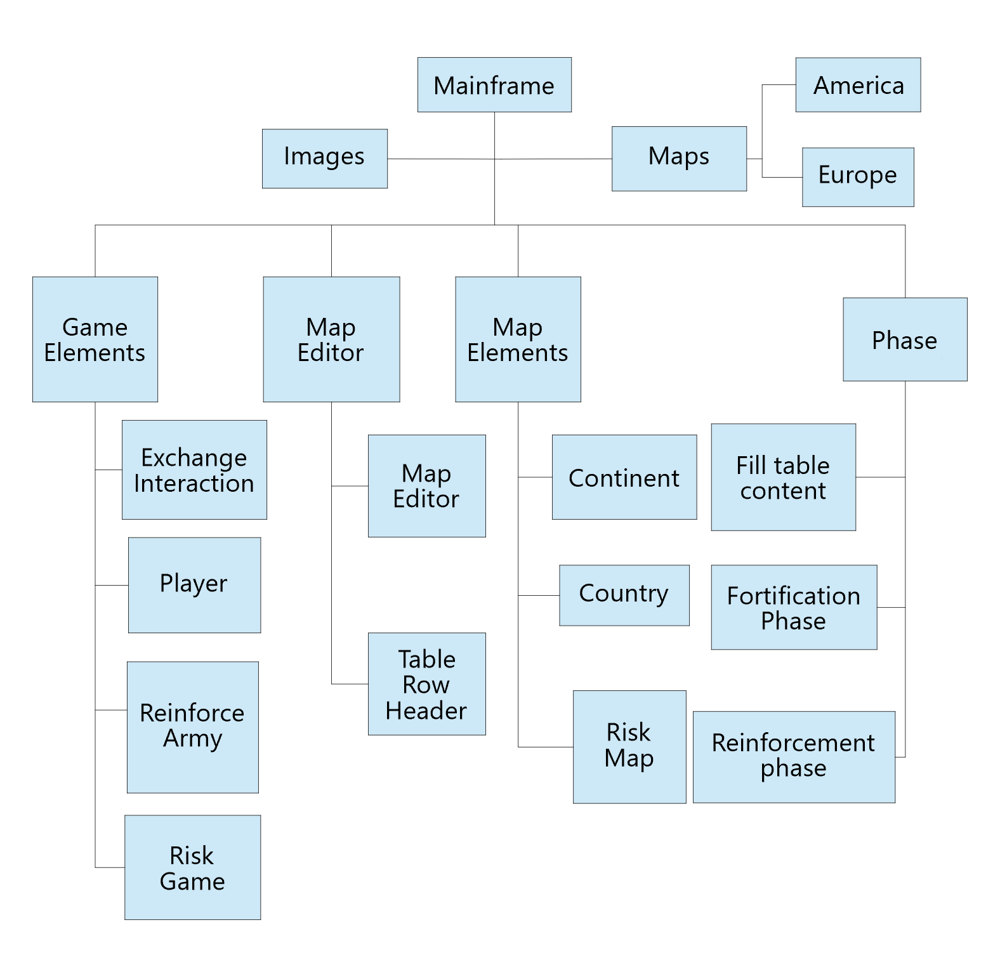

# Project Architectural Design

This document provides a comprehensive architectural overview of the project, to depict different aspects of the project.

The Graph below is the modular organization diagram.

## Modules Description

### 1.1 Game Elements
The GameElements folder includes all the elements about the risk game.

File_Name  | Description
------------- | -------------
ExchangeInteraction  | 
Player  | 
ReinforceArmy  | 
RiskGame  | 

### 1.2 Map Editor
The MapEditor folder includes all the elements about editting map.

File_Name  | Description
------------- | -------------
MapEditor  | 
TableRowHeader  | 

### 1.3 Map Elements
The MapElements folder includes all the elements used in the map file.

File_Name  | Description
------------- | -------------
Continent  | 
Country  | 
RiskMap  | 

### 1.4 Phases
The Phase folder includes all the phases in the risk game

File_Name  | Description
------------- | -------------
FillTableContent  | Fill the table with countries' name and their armies
FortificationPhase  | 
ReinforcementPhase  | 

### 1.5 Maps
The folder is used to store map files.

### 1.6 Images
The folder includes all the images used in the risk game.