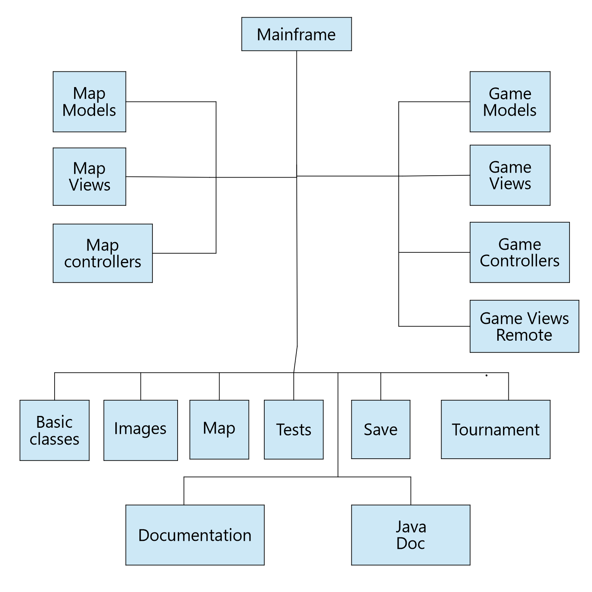

# Project Architectural Design

This document provides a comprehensive architectural overview of the project, to depict different aspects of the project.

The Graph below is the modular organization diagram.

## Modules Description

### 1.1 Map Models

File_Name  | Description
------------- | -------------
ContinentModel  | This is the class for defining continent module.
CountryModel  | This is the class for defining country module.
ErrorMsg  | This is the class used to return result of a method
RiskMapModel  | This is class RiskMap module to represent a map in Risk Game.

### 1.2 Map Views

File_Name  | Description
------------- | -------------
BasicInfoView  | This is a view class to show basic information of game.
ComponentRenders  | Render components
MapEditorView  | Class used to create a window for designers to edit maps for games.

### 1.3 Map Controllers

File_Name  | Description
------------- | -------------
BasicInfoController  | Class acting as the BasicInfoView's controller, to define action performed according to different users' action
MapEditorController  | Class acting as the MapEditorView's controller, to define action performed according to different users' action.

### 1.4 Game Modules

File_Name  | Description
------------- | -------------
Aggressive | Aggressive strategy  in reinforcement and attack and fortification phase
Benevolent | Benevolent strategy in reinforcement and attack and fortification phase
Cheater | Cheater strategy in reinforcement, attack and fortification phase
Human | Human strategy in reinforcement, attack and fortification phase
Random | Random strategy in reinforcement, attack and fortification phase
Strategy | Interface of Strategy
NodeRecord  | This is a base class used to record brief information of a country, is used in all phases of a game.
ObservbleNodes  | User-defined observable array of nodes
PlayerModel  | This is class for defining player. A player belongs to a RiskGame object, has amount of armies, can own several countries.
RiskGameModel  | This is the Class RiskGame to represent and control a game.

### 1.5 Game Views

File_Name  | Description
------------- | -------------
AttackPhaseView  | This class is the implementation of reinforcement phase in the Risk.
ComponentRenders  | The class is to describe the main part of the Risk game
DominationView   | This is the view class of Domination view show the chart of domination.
FortificationPhaseView  | This class is the implementation of Fortification phase in the Risk. The FortificationPhaseView class will allow players add armies to their to their country, based on the countries under control.
ObservableNodes  | User-defined observable array of nodes
PhaseView  | PhaseView is the GUI for monitors to see the progress of a game.
PutInitialArmyView  | Class to define the GUI for players to place one by one their initial given armies on their own countries.
ReinforcePhaseView  | This class is the implementation of reinforcement phase in the Risk.
RaskGameMainView  | The class is used to create a window for player to edit maps of games.
RiskGameView  | The class is used to create a window for player to edit maps of the game.
TradeInCards  | This class is GUI for Exchange cards to armies.
TradeInCardsView  | This class is phase view using observer.
AssignPlayerStrategy | This class is the implementation of attack dice in the Risk.

### 1.6 Game Controllers

File_Name  | Description
------------- | -------------
RiskGameController  | Class acting as the RiskGameView's controller, to define action performed according to different users' action.
MonitorInterface | The interface for the monitor
RiskGameMonitor | The monitor interface of risk game

### 1.7 Game Views Remote
File_Name  | Description
------------- | -------------
DominationViewRemote | Class to display the domination status
LogWindowRemote | Class to define log window
PhaseViewRemote | PhaseView is the GUI for monitors to see the progress of a game
TradeCardsViewRemote | Class to monitor the trade cards process
ComponentRenders | Class to render components

### 1.8 BasicClasses

File_Name  | Description
------------- | -------------
Log	 | Class for define a observable log string
MyPopupMenu  | Class to extend JPopupMenu, add one new varible and relative methods
MyTable  | Class to extend JTable, add two new methods.
MyTree  | Class to extend JTable, add one new method.
RowHeaderTable  | Class for row headers

### 1.9 Tests
The module includes all unit tests about the project.

File_Name  | Description
------------- | -------------
AttackPhase  | Unit test case about attack phase
ContinentTest  | Unit test case about continent.
CountryTest  | Unit test case about country.
FortificationPhaseTest  | Unit test case about fortification phase.
PlayerModelTest  | Unit test case about player model.
PlayerTestReinforcementArmies  | Unit test case about reinforcement armies in player.
RiskGameModelTest  | Unit test case about risk game model.
RiskMapTest  | Unit test case about risk map.
TestStartupPhase  | Unit test case about startup phase.
TestSuit  | Testsuit includes all the unit testcases

### 1.10 Maps
The module is used to store map files.

### 1.11 Images
The module includes all resource files used in the risk game.

### 1.12 Save
The module includes all save files.

### 1.13 Tournament
The module includes all tournament files.

### 1.14 JavaDoc
The module includes JavaDoc generated from the project

### 1.15 Documentation
The module includes all the docments of the project

